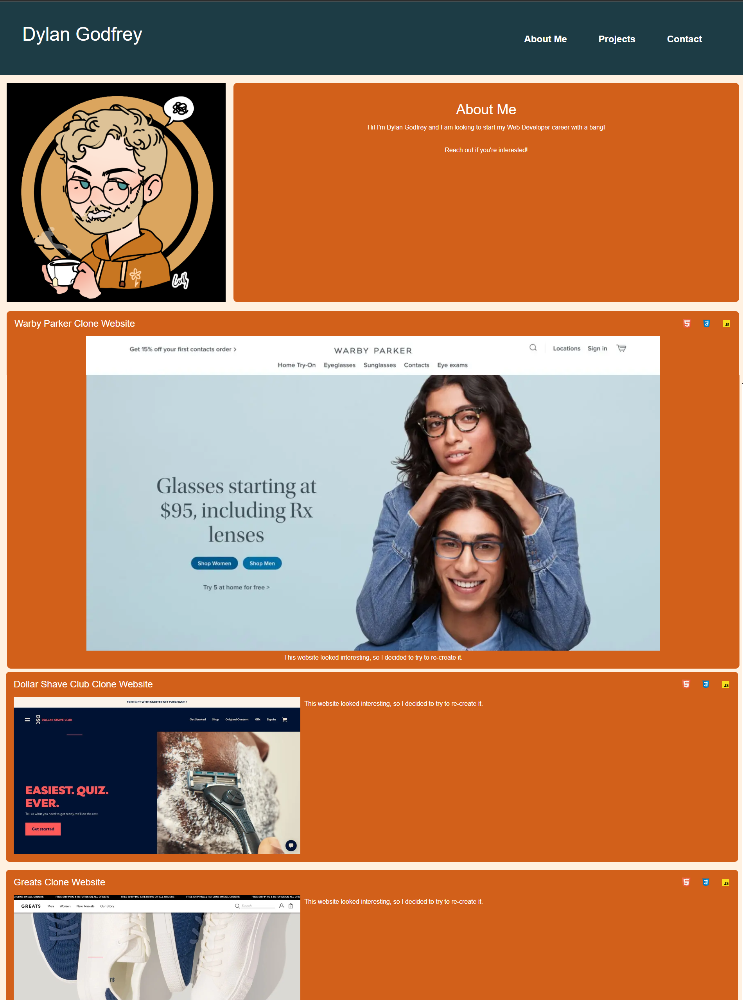

# Portfolio

## Description

The motivation of this project was to make a functioning, responsive portfolio webpage that is current with Web Development standards from scratch. Through this project I gained a deeper understanding of flexbox and how it interacts with  non-perfect images on a page. Using media queries, I also learned how to create a responsive navigation bar.


## Installation

To install, clone the repo:
```
git clone https://github.com/DylanGodfrey/Portfolio
```

## Usage

Clicking the links in the nav bar will jump the broswer window to the corresponding anchor. Clicking on a project image will bring you to its repo.

Link to GitHub Pages deployment: https://dylangodfrey.github.io/Portfolio




## Credits

Created by: [Dylan Godfrey](https://github.com/DylanGodfrey/)

## License

MIT License

Copyright (c) 2022 Dylan Godfrey

Permission is hereby granted, free of charge, to any person obtaining a copy
of this software and associated documentation files (the "Software"), to deal
in the Software without restriction, including without limitation the rights
to use, copy, modify, merge, publish, distribute, sublicense, and/or sell
copies of the Software, and to permit persons to whom the Software is
furnished to do so, subject to the following conditions:

The above copyright notice and this permission notice shall be included in all
copies or substantial portions of the Software.

THE SOFTWARE IS PROVIDED "AS IS", WITHOUT WARRANTY OF ANY KIND, EXPRESS OR
IMPLIED, INCLUDING BUT NOT LIMITED TO THE WARRANTIES OF MERCHANTABILITY,
FITNESS FOR A PARTICULAR PURPOSE AND NONINFRINGEMENT. IN NO EVENT SHALL THE
AUTHORS OR COPYRIGHT HOLDERS BE LIABLE FOR ANY CLAIM, DAMAGES OR OTHER
LIABILITY, WHETHER IN AN ACTION OF CONTRACT, TORT OR OTHERWISE, ARISING FROM,
OUT OF OR IN CONNECTION WITH THE SOFTWARE OR THE USE OR OTHER DEALINGS IN THE
SOFTWARE.
